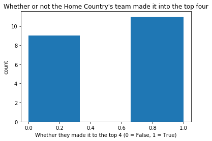

.. FootBall Visualzation documentation master file, created by
   sphinx-quickstart on Tue Nov 13 11:28:29 2018.
   You can adapt this file completely to your liking, but it should at least
   contain the root `toctree` directive.

Welcome to FootBall Visualzation's documentation!
=================================================

.. toctree::
   :maxdepth: 2
   :caption: Contents:

Indices and tables
==================

* :ref:`genindex`
* :ref:`modindex`
* :ref:`search`

Abstract
====================

This website was created by Gavin Schaeferle and Austin "last name". The purpose of this website is to analysis data about the Football World Cup. To do this, we set about answering one big question: **How has the world cup changed over time?** To answer this question, we focused on multiple aspects of our data, these subsections are 

#. "Does being the host country increase your chances of winning?" 
#. "Does being the home team in a match increase your chances of winning?"
#. "Which country has won the most World Cups? And Which team won the most matches within the World Cup?
#. "Which World Cup has had the most scoring?"
#. "Which World Cup had the most autendous?"
#. "Which World Cup had the most penenties?"

In the end, we found that the world cup has been increasing in popularity and increasing in the number of teams participating. However, the most interesting thing to notice, is how the world cup not only grow on it's own, but also grew along side the world as a whole. 

Data Accusition
============================
The first step to any data science project, is to aquire some data. In our project, this was done be vigorously scrolling through the internet, trying to find any data on the World Cup. Our first stop was kaggle.com, because it has some really good data on a lot of different subjects, expetinoally sports. And after looking around for a while, we did in fact find the data we were looking for `here <...>`_. On that website's page, we found three datasets. The first had information on the gernal world cups from 1930 to 2014. The second had information on each match that happened at each world cup. The last on had information each people and couch of each team in each world cup. From this data, we had to do a little data monuvering to get them all together and working. This was done by doing a quick join in pandas like this: 

.. code-block:: python
	matchesJoin = matches.set_index(['Year']).join(cups.drop(['Attendance'],axis = 1).set_index(['Year']))

the dataframe *matches* is the dataframe with every match in each world cup. next, the set_index(['Year']) is used to make sure the two dataframes have the same index. Next, within the join function, the *cups* dataframe contains the gernal information on each world cup. Notice the .drop function being called on the *cups* dataframe. This was done because both *matches* and *cups* have a column called "Attendance" so to make the join work, one of them had to go. We choose to drop the *cups* column because there are more match attendaces then cups so later on the *matches* attendance column will be used along with the other info in *matches* and *cups* so having that column is more important. Finally, we set the index of the *cups* dataframe to be the same as the *matches* dataframe and we got ourselves a good joined dataframe. This is just the beginning of all the data munipulations that are done to this dataframe to create the graphs later on in this website. 

Host Country Data
==========================================
To start answer the big question **How has the world cup changed over time?** we started by looking at how the host country did over time, and how has being the "home" country changed over time. `Here <notebooks/Worldcupdata.ipynb>`_ is the analysis of that data

From this analysis we created four graphs. The first one shows the number of times a host country made it into the final four. 

In 

